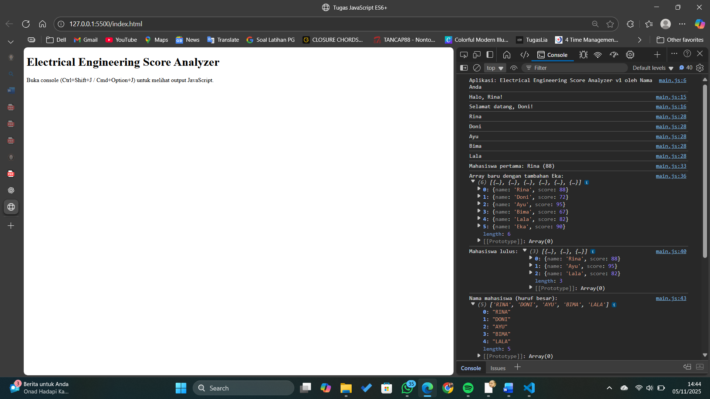
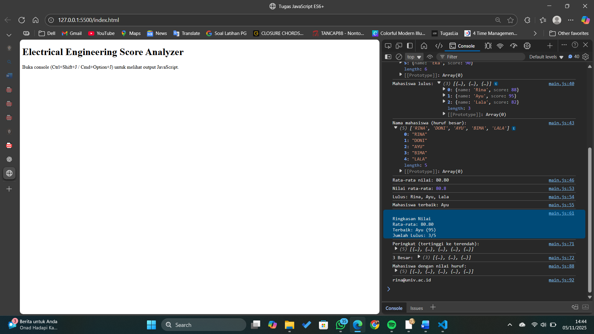

# Electrical Engineering Score Analyzer ⚡

Proyek ini merupakan tugas JavaScript (ES6+) untuk menganalisis nilai mahasiswa dengan fitur:
- Variabel menggunakan `let` dan `const`
- Fungsi dan arrow function
- Manipulasi array & object
- Destructuring dan spread operator
- Array method modern (`map`, `filter`, `reduce`)
- Template literal untuk output rapi
- Fungsi modular (`getAverage()`, `getPassed()`, `getTopStudent()`)
- Bonus: ranking, nilai huruf (A–E), dan optional chaining

---

## 💻 Hasil Program

### 🖼️ Tampilan di Browser

### ⚙️ Output di Console

---

## 📂 Struktur Folder
tugas-js-es6/
├── index.html
├── main.js
├── hasil1.png
├── hasil2.png
└── README.md

---

---

## ✨ Author
**Nama:** Frans Daniel Alexander Sinaga  
**Mata Kuliah:** Web Development

